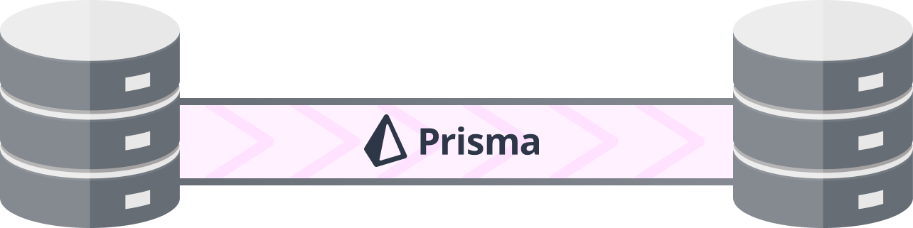

<p align="center">
  
  <h1 align="center">Prisma Databases Sync</h1>
</p>

I implemented this CLI because I had to migrate from a PostgreSQL database to a MySQL database for my startup [Typebot](https://typebot.io/). Prisma takes care of the data transformation and this allows you to migrate without downtime.

> I just tested the scripts with my setup. You may have to tweak things for yours. Feel free to create an issue so that I can help 👌

## Features

- Sync data from and to any database (PostgreSQL, MySQL, MongoDB etc...) as long as it is supported by Prisma
- Incremental sync (based on `@updatedAt` or `@createdAt`). To avoid extracting all the data every time.

You just have to provide 2 prisma schemas: source and target.

The first data sync will take some time because it will download all the data from the beginning. Then, subsequent syncs will be tiny and will happen in an instant.

## Get started

1. Clone the repository
2. Copy `.env.example` to `.env` and fill it with your database URLs (It is recommended to disable the prisma pool timeout using the `?pool_timeout=0` query param).
3. Edit `src/schemas/source.prisma` and `src/schemas/target.prisma` with your schemas. Make sure it contains:

   ```
   generator utils {
     provider = "pnpm tsx src/generatePrismaUtilsTypes.ts"
     output   = "prisma-clients/target"
   }
   ```

4. Install dependencies and generate prisma clients: `pnpm install`
5. Run the CLI: `pnpm start`, it will popup the menu
   ```
   ?  › - Use arrow-keys. Return to submit.
   ❯   Sync - Watch for changes in your source database and inject it in your target database
       Dump
       Inject
   ```

## How to use

This library has 3 functions `dump`, `inject`, `sync`:

- `dump` reads your source database and generate timestamped snapshots
- `inject` injects the previously imported snapshots chronologically
- `sync` executes dump and restore with a set interval

This is perfect if you are planning on migrating to another database in production. The first dump will be quite big as it will pull all the data from the beginning. Subsequent dumps will be tiny.

Let's say you need to migrate to a new database and can't afford to have application downtime:

1. Launch a sync job to sync the target database with the source database.
2. Deploy your application version that consumes the target database
3. Once it's deployed, make sure the sync job doesn't detect new data from source database for at least 30 minutes.
4. 🎉 Congrats, you migrated to a new database with no downtime.

## Limitations

It doesn't detect if a row has been deleted on the source database.

Foreign keys can make it difficult to sync data. Two options are:

- Defer constraints (recommended)
- Disable foreign key triggers, which can silently break referential integrity (not recommended)

If your target schema uses `prisma` relationMode (or if it's a MongoDB database), you need to set the relationMode to `foreignKeys`
